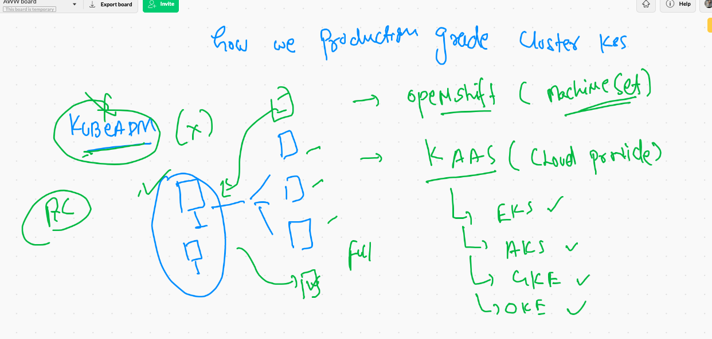
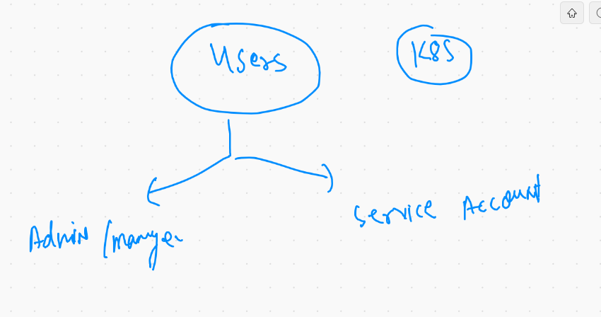

# Packaging and Namespace 

## Best practise to deploy application in k8s

## Deploying app in specific namespace 

## File 

```❯ cat package.yml
apiVersion: v1
kind: Namespace
metadata:
  creationTimestamp: null
  name: ashuns
spec: {}
status: {}

---


apiVersion: apps/v1
kind: Deployment
metadata:
  creationTimestamp: null
  labels:
    app: ashudep11
  name: ashudep11
  namespace: ashuns  #  adding namespace line 
spec:
  replicas: 2
  selector:
    matchLabels:
      app: ashudep11
  strategy: {}
  template:
    metadata:
      creationTimestamp: null
      labels:
        app: ashudep11
    spec:
      containers:
      - image: dockerashu/httpd:ashuappv2
        name: httpd
        resources: {}
status: {}

---

apiVersion: v1
kind: Service
metadata:
  creationTimestamp: null
  labels:
    app: ashusvcday5
  name: ashusvcday5
  namespace: ashuns # adding namespace line 
spec:
  ports:
  - name: 4444-80
    port: 4444
    protocol: TCP
    targetPort: 80
  selector:
    app: ashudep11  #  same as label of POD 
  type: LoadBalancer
status:
  loadBalancer: {}

```
===

```
❯ kubectl  apply -f  package.yml
namespace/ashuns created
deployment.apps/ashudep11 created
service/ashusvcday5 created
```

## history 

```
 371  kubectl  create  namespace  ashuns  --dry-run=client -o yaml  >package.yml 
  372  cat  package.yml
  373  hist
  374  history
  375  kubectl  create  deployment  ashudep11 --image=dockerashu/httpd:ashuappv2 --dry-run=client -o yaml >>package.yml
  376  hist
  377  history
  378  vim package.yml
  379  clear
  380  kubectl create service  loadbalancer  ashusvcday5  --tcp 4444:80  --dry-run=client -o yaml >>package.yml
  381  vim  package.yml
  382  kubectl get  ns
  383  kubectl  apply -f  package.yml 
  384  cat package.yml
  385  clear
  386  kubectl  get  ns
  387  kubectl  get  all  -n ashuns 
  388  kubectl  get  deploy,pod,svc -n ashuns
  389  kubectl get ns
  390  kubectl  get  deploy,pod,svc -n nikhilns
  391  kubectl  get  deploy,pod,svc -n ashuns
  392  kubectl delete all --all -n ashuns 
  393  kubectl apply -f  package.yml
  394  kubectl  get  deploy,pod,svc -n ashuns
  
 ```
 
 ## Database with persistent storage
 
 ```
 docker  run -d  --name mydb  -e  MYSQL_ROOT_PASSWORD=cisco123  -p 1234:3306 -v ashudbvol:/var/lib/mysql  mysql
 ```
 
 ## On kubenetes 
 
 ```
 ❯ kubectl  run   ashudb  --image=mysql --port 3306  --namespace  ashuns --dry-run=client -o yaml
apiVersion: v1
kind: Pod
metadata:
  creationTimestamp: null
  labels:
    run: ashudb
  name: ashudb
  namespace: ashuns
spec:
  containers:
  - image: mysql
    name: ashudb
    ports:
    - containerPort: 3306
    resources: {}
  dnsPolicy: ClusterFirst
  restartPolicy: Always
status: {}
❯ kubectl  run   ashudb  --image=mysql --port 3306  --namespace  ashuns --dry-run=client -o yaml  >ashudb.yml

```

## using configMap to store variable data

```
kubectl  create  configmap  mydbpass   --from-literal  x=cisco1234 -n ashuns

```

# Kubernetes storage 


## EmptyDir volume 

```
❯ cat  empvol.yml
apiVersion: v1
kind: Pod
metadata:
  creationTimestamp: null
  labels:
    run: ashupod111
  name: ashupod111
  namespace: ashuns
spec:
  volumes:
  - name: ashuvol1  # volume name 
    emptyDir: {}  # type of volume 
  containers:
  - image: alpine
    name: ashupod111
    volumeMounts:
    - name: ashuvol1  # this name must be same as above volume 
      mountPath: /mnt/cisco # here volume will be mounted 
    command: ["/bin/sh","-c","while true;do echo hello >>/mnt/cisco/data.txt;sleep 2;done"]
    resources: {}
  dnsPolicy: ClusterFirst
  restartPolicy: Always
  
 ```
 
 ## multi container pods
 
 ```
 ❯ cat  empvol.yml
apiVersion: v1
kind: Pod
metadata:
  creationTimestamp: null
  labels:
    run: ashupod111
  name: ashupod111
  namespace: ashuns
spec:
  volumes:
  - name: ashuvol1  # volume name 
    emptyDir: {}  # type of volume 
  containers:
  - image: alpine
    name: ashupod111
    volumeMounts:
    - name: ashuvol1  # this name must be same as above volume 
      mountPath: /mnt/cisco # here volume will be mounted 
    command: ["/bin/sh","-c","while true;do echo hello >>/mnt/cisco/index.html;sleep 2;done"]
    resources: {}
  - image: nginx
    name: ashuc1
    ports:
    - containerPort: 80
    volumeMounts:
    - name: ashuvol1
      mountPath: /usr/share/nginx/html/ 
  dnsPolicy: ClusterFirst
  restartPolicy: Always


```

# HostPath volume 

```
❯ cat  hostvol.yml
apiVersion: v1
kind: Pod
metadata:
  creationTimestamp: null
  labels:
    run: podx1
  name: podx1
spec:
  nodeName: ip-172-31-76-63.ec2.internal  # here its a manual scheduling
  volumes:
  - name: ashuvol22
    hostPath:  # from the minion node where your pod will be scheduled 
     path: /etc
     type: Directory 
  containers:
  - command:
    - ping
    - fb.com
    image: alpine
    name: podx1
    volumeMounts:
    - name: ashuvol22
      mountPath: /mnt/ashutoshh
    resources: {}
  dnsPolicy: ClusterFirst
  restartPolicy: Always
  
 ```
 
## deploy and check 

```
░▒▓ ~/Desktop/microservices ······································································· 03:21:46 PM ▓▒░─╮
❯                                                                                                                    ─╯
❯ kubectl apply -f  hostvol.yml  -n ashuns
pod/podx1 created
❯ kubectl get  po -n ashuns
NAME    READY   STATUS    RESTARTS   AGE
podx1   1/1     Running   0          13s
❯ kubectl exec -it podx1 sh -n ashuns
kubectl exec [POD] [COMMAND] is DEPRECATED and will be removed in a future version. Use kubectl exec [POD] -- [COMMAND] instead.
/ # cd  /mnt/ashutoshh/
/mnt/ashutoshh # ls
DIR_COLORS               exports                  mke2fs.conf              rsyslog.d
DIR_COLORS.256color      exports.d                modprobe.d               rwtab
DIR_COLORS.lightbgcolor  filesystems              modules-load.d           rwtab.d
GREP_COLORS              fstab                    motd                     sasl2
GeoIP.conf               gcrypt                   mtab                     scl

```

# Portainer using kubernetes 

```
apiVersion: v1
kind: Pod
metadata:
  creationTimestamp: null
  labels:
    run: dockerweb
  name: dockerweb
spec:
  nodeName: ip-172-31-76-63.ec2.internal 
  volumes:
  - name: ashuvol101
    hostPath: 
     path: /var/run/docker.sock
     type: Socket
  containers:
  - image: portainer/portainer
    name: dockerweb
    ports:
    - containerPort: 9000
    volumeMounts:
    - name: ashuvol101
      mountPath: /var/run/docker.sock 
    resources: {}
  dnsPolicy: ClusterFirst
  restartPolicy: Always
  
 ```
 
 ## Exposing POrt
 
 ```
 kubectl  expose pod dockerweb --type NodePort --port 1234 --target-port 9000 -n ashuns
```

# K8s In cloud as KAAS



## Kubernetes Dashboard 

## K8s Users



## SErvice account in Namespace 

```
❯ kubectl get  serviceaccount
NAME      SECRETS   AGE
default   1         29h
❯ kubectl get  sa   -n kube-public
NAME      SECRETS   AGE
default   1         29h
❯ kubectl get  sa   -n ashuns
NAME      SECRETS   AGE
default   1         5h23m


```
## Kubernetes Dashboard Deployment 

```
kubectl apply -f https://raw.githubusercontent.com/kubernetes/dashboard/v2.0.0/aio/deploy/recommended.yaml
namespace/kubernetes-dashboard created
serviceaccount/kubernetes-dashboard created
service/kubernetes-dashboard created
secret/kubernetes-dashboard-certs created
secret/kubernetes-dashboard-csrf created
secret/kubernetes-dashboard-key-holder created
configmap/kubernetes-dashboard-settings created
role.rbac.authorization.k8s.io/kubernetes-dashboard created
clusterrole.rbac.authoriza

```
## checking dashboard deployment 

```
❯ kubectl get ns
NAME                   STATUS   AGE
anins                  Active   5h34m
ashuns                 Active   5h27m
default                Active   29h
grv-space              Active   22h
kube-node-lease        Active   29h
kube-public            Active   29h
kube-system            Active   29h
kubernetes-dashboard   Active   55s
nikhilns               Active   5h26m
nilaratan-space        Active   22h
nilarns                Active   5h27m
sou-namespace          Active   58m
test                   Active   5h42m
❯ kubectl get  po  -n kubernetes-dashboard
NAME                                         READY   STATUS    RESTARTS   AGE
dashboard-metrics-scraper-7b59f7d4df-bj6zk   1/1     Running   0          52s
kubernetes-dashboard-74d688b6bc-9m57v        1/1     Running   0          56s
❯ kubectl get  svc   -n kubernetes-dashboard
NAME                        TYPE        CLUSTER-IP      EXTERNAL-IP   PORT(S)    AGE
dashboard-metrics-scraper   ClusterIP   10.100.198.44   <none>        8000/TCP   75s
kubernetes-dashboard        ClusterIP   10.100.23.105   <none>        443/TCP    87s

```


###

```
❯ kubectl  edit  svc  kubernetes-dashboard   -n  kubernetes-dashboard
service/kubernetes-dashboard edited
❯ kubectl get  svc -n kubernetes-dashboard
NAME                        TYPE        CLUSTER-IP      EXTERNAL-IP   PORT(S)         AGE
dashboard-metrics-scraper   ClusterIP   10.100.198.44   <none>        8000/TCP        4m52s
kubernetes-dashboard        NodePort    10.100.23.105   <none>        443:30431/TCP   5m4s
  
```
  
  ## checking Secret token of k8s dashboard service account 
  
  ```
   514  kubectl  get  sa  -n  kubernetes-dashboard   
  515  kubectl  get  secret  -n  kubernetes-dashboard   
  516  kubectl describe secret kubernetes-dashboard-token-r88lf  -n   kubernetes-dashboard  
  
  ```
  
  ## Assing clusterrole to service account using cluster role binding 
  
  ```
  ❯ cat k8ssvcclsrole.yml
apiVersion: rbac.authorization.k8s.io/v1
kind: ClusterRoleBinding
metadata:
  name: admin-user
roleRef:
  apiGroup: rbac.authorization.k8s.io
  kind: ClusterRole
  name: cluster-admin
subjects:
- kind: ServiceAccount
  name: kubernetes-dashboard
  namespace: kubernetes-dashboard
  
  ```
  
  
  
 ## Service of Cluster IP type 
 
 
