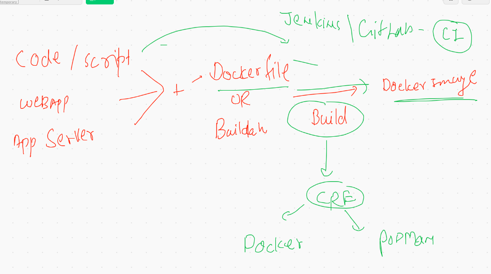
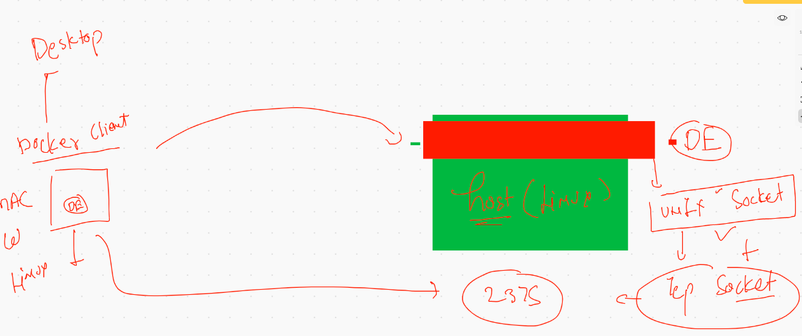
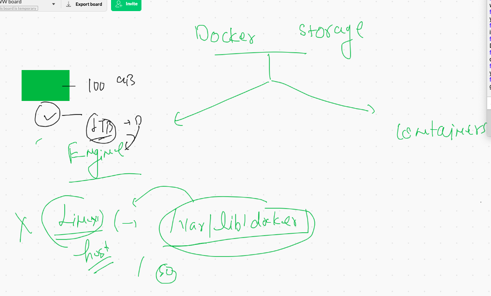
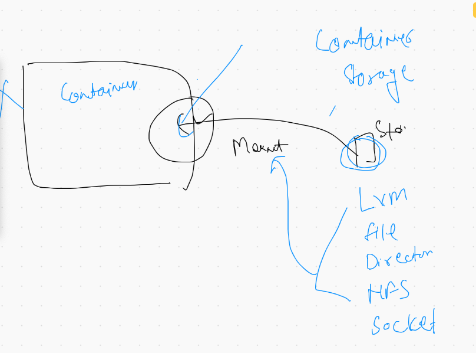

# Docker Build Process revesion 



## Docker client with Unix &. TCP socket 



## Starting docker Engine In tcp Socket 

```
[ec2-user@ip-172-31-58-55 ~]$ cd  /etc/sysconfig/
[ec2-user@ip-172-31-58-55 sysconfig]$ ls
acpid       clock     docker          init        modules          nfs            rpc-rquotad  run-parts  sysstat.ioconf
atd         console   docker-storage  irqbalance  netconsole       raid-check     rpcbind      selinux
authconfig  cpupower  grub            keyboard    network          rdisc          rsyncd       sshd
chronyd     crond     i18n            man-db      network-scripts  readonly-root  rsyslog      sysstat
[ec2-user@ip-172-31-58-55 sysconfig]$ sudo vim  docker 
[ec2-user@ip-172-31-58-55 sysconfig]$ cat  docker
# The max number of open files for the daemon itself, and all
# running containers.  The default value of 1048576 mirrors the value
# used by the systemd service unit.
DAEMON_MAXFILES=1048576

# Additional startup options for the Docker daemon, for example:
# OPTIONS="--ip-forward=true --iptables=true"
# By default we limit the number of open files per container
OPTIONS="--default-ulimit nofile=1024:4096   -H  tcp://0.0.0.0:2375"

# How many seconds the sysvinit script waits for the pidfile to appear
# when starting the daemon.
DAEMON_PIDFILE_TIMEOUT=10

```

## docker enginre reload 

```
[ec2-user@ip-172-31-58-55 sysconfig]$ sudo systemctl daemon-reload 
[ec2-user@ip-172-31-58-55 sysconfig]$ sudo systemctl restart  docker
[ec2-user@ip-172-31-58-55 sysconfig]$ sudo netstat -nlpt
Active Internet connections (only servers)
Proto Recv-Q Send-Q Local Address           Foreign Address         State       PID/Program name    
tcp        0      0 0.0.0.0:111             0.0.0.0:*               LISTEN      3345/rpcbind        
tcp        0      0 0.0.0.0:22              0.0.0.0:*               LISTEN      4644/sshd           
tcp        0      0 127.0.0.1:25            0.0.0.0:*               LISTEN      4172/master         
tcp        0      0 127.0.0.1:44605         0.0.0.0:*               LISTEN      4055/containerd     
tcp6       0      0 :::2375                 :::*                    LISTEN      5597/dockerd        
tcp6       0      0 :::111                  :::*                    LISTEN      3345/rpcbind        
tcp6       0      0 :::22                   :::*                    LISTEN      4644/sshd 
```

## connecting Docker engine using python client 

```
ashutoshhs-MacBook-Air:Desktop fire$ cat mydockercli.py 
import  docker
import time
# if you want to connect  Docker locally running on Mac / w /Linux 

client=docker.DockerClient(base_url='tcp://100.25.45.150:2375')

## code for listing image 

for  i in  client.containers.list():
	print i
	
## list of images 
for  i in  client.images.list():
	print i


```

# Docker Storage



## Configure storage

```
[ec2-user@ip-172-31-58-55 ~]$ sudo  mkdir  /mnt/cisco 
[ec2-user@ip-172-31-58-55 ~]$ 
[ec2-user@ip-172-31-58-55 ~]$ sudo  vim  /etc/sysconfig/docker 
[ec2-user@ip-172-31-58-55 ~]$ cat  /etc/sysconfig/docker
# The max number of open files for the daemon itself, and all
# running containers.  The default value of 1048576 mirrors the value
# used by the systemd service unit.
DAEMON_MAXFILES=1048576

# Additional startup options for the Docker daemon, for example:
# OPTIONS="--ip-forward=true --iptables=true"
# By default we limit the number of open files per container
OPTIONS="--default-ulimit nofile=1024:4096   -H  tcp://0.0.0.0:2375  -g  /mnt/cisco"

# How many seconds the sysvinit script waits for the pidfile to appear
# when starting the daemon.
DAEMON_PIDFILE_TIMEOUT=10


```

## checking new storage

```
  345  sudo systemctl daemon-reload 
  346  sudo systemctl restart  docker  
  347  sudo ls  /mnt/cisco/
  348  docker  info 
  349  history 
[ec2-user@ip-172-31-58-55 ~]$ sudo ls  /mnt/cisco/
builder  buildkit  containers  image  network  overlay2  plugins  runtimes  swarm  tmp	trust  volumes

```

## Container storage



## Docker volume 

```
  355  docker  volume  list
  356  docker  volume  create  ashuvol1 
  357  docker  volume  list
  358  docker run  -it  --rm  -v  ashuvol1:/mnt/data alpine  sh 
  359  docker  volume  ls
  360  docker  run  -it  -v  ashuvol1:/mydata   centos  bash 
  364  docker  voluem  ls
  365  docker  volume ls
  366  docker  volume inspect  ashuvol1 
  369  docker  volume inspect  ashuvol1 
  370  sudo ls  /mnt/cisco/volumes
  371  docker  volume create  x1 
  372  sudo ls  /mnt/cisco/volumes
  373  docker  volume inspect    x1 
  376  docker  volume  ls
  377  docker  run  -d  --name  x1ashu  -v  ashuvol1:/mnt/cool:rw   alpine  ping  fb.com  
  378  docker  run  -dit --name  x2x2  -v  ashuvol1:/mnt/data:ro   centos  bash 
  docker  run  -it --rm   -v  ashuvol1:/mnt/check:rw  -v  x1:/mnt/go:ro  alpine sh
  
  
  ```
  
  ## External forlder as volume 
  
  ```
  docker  run  -d -v  /home/ec2-user/day2/microsoftapp/project-html-website:/usr/share/nginx/html:ro  -p 1122:80   nginx  
  ```
  
  
