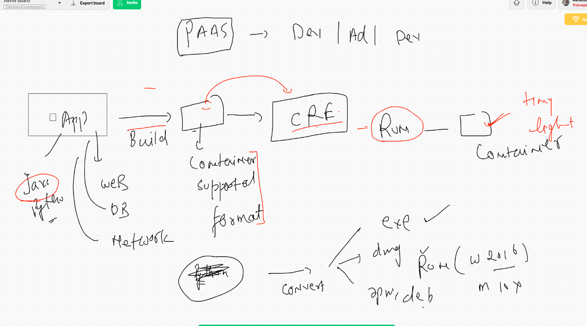
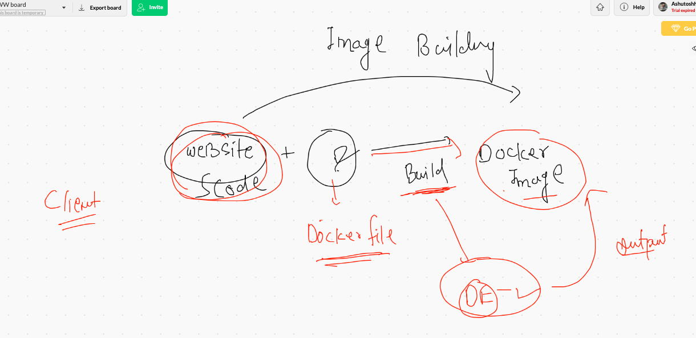
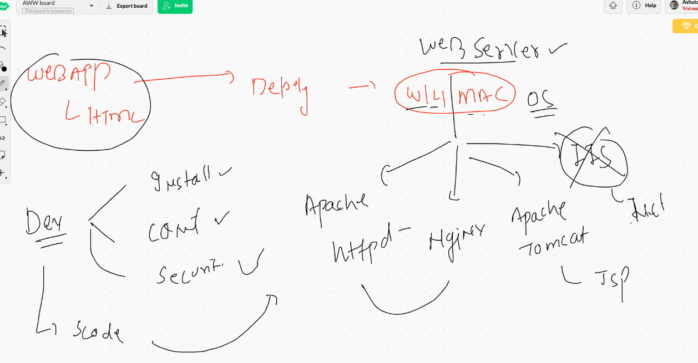

# Containerization 

##  Convert an app/code/webserver/db/networkapp into container format 



## Install docker again 

```
  5  sudo  yum install  docker  -y
    6  history 
    7  sudo systemctl start  docker 
    8  sudo systemctl status docker 
    9  history 
   10  sudo systemctl status docker 
   11  history 
   12  sudo systemctl enable  docker 

```

## Adding a non root user into docker group for Docker engine access

```
[ec2-user@ip-172-31-58-55 ~]$ grep  docker    /etc/group   
docker:x:993:
[ec2-user@ip-172-31-58-55 ~]$ 
[ec2-user@ip-172-31-58-55 ~]$ 
[ec2-user@ip-172-31-58-55 ~]$ whoami
ec2-user
[ec2-user@ip-172-31-58-55 ~]$ 
[ec2-user@ip-172-31-58-55 ~]$ 
[ec2-user@ip-172-31-58-55 ~]$ sudo  usermod  -a  -G  docker  ec2-user
[ec2-user@ip-172-31-58-55 ~]$ 
[ec2-user@ip-172-31-58-55 ~]$ grep  docker    /etc/group   
docker:x:993:ec2-user
[ec2-user@ip-172-31-58-55 ~]$ 

```

## Webapp Source Code into Docker image



## web server overview




## Building Docker image

```
[ec2-user@ip-172-31-58-55 beginner-html-site-styled]$ docker  build  -t   http:ashuappv1  . 
Sending build context to Docker daemon     64kB
Step 1/5 : FROM  httpd
latest: Pulling from library/httpd
bb79b6b2107f: Pull complete 
26694ef5449a: Pull complete 
7b85101950dd: Pull complete 
da919f2696f2: Pull complete 
3ae86ea9f1b9: Pull complete 
Digest: sha256:b82fb56847fcbcca9f8f162a3232acb4a302af96b1b2af1c4c3ac45ef0c9b968
Status: Downloaded newer image for httpd:latest
 ---> 3dd970e6b110
Step 2/5 : MAINTAINER   ashutoshh@linux.com , 9509957594  , ashutoshh
 ---> Running in 4378c1da9fa0
Removing intermediate container 4378c1da9fa0
 ---> 20297490d511
Step 3/5 : WORKDIR  /var/www/html/
 ---> Running in 86f0e69c2259
Removing intermediate container 86f0e69c2259
 ---> 1771cce3f316
Step 4/5 : COPY .  .
 ---> 03c914bdf111
Step 5/5 : EXPOSE 80
 ---> Running in 6b752c32b199
Removing intermediate container 6b752c32b199
 ---> 46d3fcf3d21e
Successfully built 46d3fcf3d21e
Successfully tagged http:ashuappv1

```

