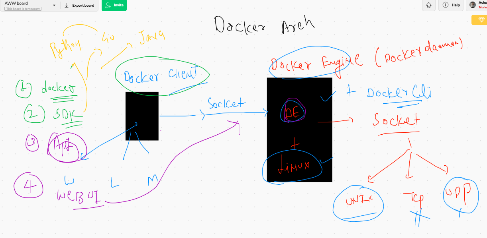

# Docker Pre 

# DNS understanding 


## Web server


## VMS vs Containers


## containers platform provides


# Installing Docker engine 

```
[ec2-user@ip-172-31-59-169 ~]$ sudo  yum  install  docker  
Failed to set locale, defaulting to C
Loaded plugins: extras_suggestions, langpacks, priorities, update-motd
amzn2-core                                                         | 3.7 kB  00:00:00     
Resolving Dependencies
--> Running transaction check
---> Package docker.x86_64 0:19.03.6ce-4.amzn2 will be installed
--> Processing Dependency: runc >= 1.0.0 for package: docker-19.03.6ce-4.amzn2.x86_64
--> Processing Dependency: containerd >= 1.3.2 for 
```

## Starting Docker engine 

```
[ec2-user@ip-172-31-59-169 ~]$ sudo systemctl  start  docker
[ec2-user@ip-172-31-59-169 ~]$ sudo systemctl  status  docker
● docker.service - Docker Application Container Engine
   Loaded: loaded (/usr/lib/systemd/system/docker.service; disabled; vendor preset: disabled)
   Active: active (running) since Mon 2020-10-19 07:14:14 UTC; 9s ago
     Docs: https://docs.docker.com
  Process: 3845 ExecStartPre=/usr/libexec/docker/docker-setup-runtimes.sh (code=exited, status=0/SUCCESS)
  Process: 3832 ExecStartPre=/bin/mkdir -p /run/docker (code=exited, status=0/SUCCESS)
 Main PID: 3855 (dockerd
 
 ```
 
 ## Docker architecture
 
 
 
 ## Docker client options 
 
 
 
 ## Docker images are stored in PUblic/private Registries 
 
 ### Docker Hub 
 ###  Quay.io
 ###  GCR 
 
## Docker parent process understanding 


## Some Docker commands 

### Search & Pull 


```
19  sudo docker  search  python 
   20  sudo docker  search  java
   21  history 
   22  sudo docker  search  mongodb
   23  history 
   24  sudo docker  images
   25  sudo docker  pull  java
   26  sudo docker  images
   27  sudo docker  pull  python 
   28  sudo docker  pull  mysql 
   
```

## container create and manage 

```
54  sudo  docker  run    alpine    cal 
   55  sudo  docker  run    alpine    ping  8.8.8.8
   56  history 
   57  sudo docker   ps
   58  sudo docker   ps -a
   59  history 
   60  sudo docker   ps -a
   61  sudo  docker  run    python   cal 
   62  sudo  docker  run    mysql   cal 
   63  history 
   64  sudo docker  images
   65  sudo docker  ps
   66  sudo docker  ps -a
   67  clear
   68  sudo  docker  run  alpine  ping fb.com 
   69  sudo  docker  run  -d  alpine  ping fb.com 
   70  sudo docker  ps
   71  history 
   72  sudo docker  ps
   73  sudo  docker  logs 8ab77bb388e2  
   74  history 
   75  sudo docker  ps  -a
   76  sudo  docker  logs c0f34bae9ffa
   
   ```

## checking parent process output 

```
 87  sudo  docker  run  -d  --name  ashuc1  alpine  ping 8.8.8.8
   88  sudo  docker  ps
   89  sudo  docker  logs   ashuc1 
   90  history 
   91  sudo  docker  logs  -f   ashuc1 

```

## kill and start operation 

```
[ec2-user@ip-172-31-59-169 ~]$ sudo  docker  ps -a
CONTAINER ID        IMAGE               COMMAND                  CREATED             STATUS                         PORTS               NAMES
2d157b7700d4        alpine              "ping 8.8.8.8"           4 minutes ago       Exited (137) 57 seconds ago                        ashuc1
8ab77bb388e2        alpine              "ping fb.com"            About an hour ago   Exited (137) 36 seconds ago                        flamboyant_keldysh
7099a54dd725        alpine              "ping fb.com"            About an hour ago   Exited (0) About an hour ago                       pedantic_einstein
68e8a9b17495        mysql               "docker-entrypoint.s…"   2 hours ago         Exited (127) 2 hours ago                           condescending_lovelace
966823db31eb        python              "cal"                    2 hours ago         Created                                            hungry_hertz
2f3817aa20c6        alpine              "ping 8.8.8.8"           2 hours ago         Exited (0) 2 hours ago                             agitated_hopper
c0f34bae9ffa        alpine              "cal"                    2 hours ago         Exited (0) 2 hours ago                             condescending_khayyam
[ec2-user@ip-172-31-59-169 ~]$ sudo docker  start  ashuc1  8ab77bb388e2 
ashuc1
8ab77bb388e2
[ec2-user@ip-172-31-59-169 ~]$ sudo  docker  ps
CONTAINER ID        IMAGE               COMMAND             CREATED             STATUS              PORTS               NAMES
2d157b7700d4        alpine              "ping 8.8.8.8"      5 minutes ago       Up 4 seconds                            ashuc1
8ab77bb388e2        alpine              "ping fb.com"       About an hour ago   Up 3 seconds    

```

## child process using Docker exec

```
[ec2-user@ip-172-31-59-169 ~]$ sudo  docker   exec  ashuc1   cal 
    October 2020
Su Mo Tu We Th Fr Sa
             1  2  3
 4  5  6  7  8  9 10
11 12 13 14 15 16 17
18 19 20 21 22 23 24
25 26 27 28 29 30 31
                     
[ec2-user@ip-172-31-59-169 ~]$ sudo  docker   exec  ashuc1   ping fb.com 
PING fb.com (31.13.66.35): 56 data bytes
64 bytes from 31.13.66.35: seq=0 ttl=51 time=1.072 ms
64 bytes from 31.13.66.35: seq=1 ttl=51 time=1.164 ms
64 bytes from 31.13.66.35: seq=2 ttl=51 time=1.128 ms
^C
[ec2-user@ip-172-31-59-169 ~]$ sudo docker  ps
CONTAINER ID        IMAGE               COMMAND             CREATED             STATUS              PORTS               NAMES
2d157b7700d4        alpine              "ping 8.8.8.8"      11 minutes ago      Up 5 minutes                            ashuc1
8ab77bb388e2        alpine              "ping fb.com"       2 hours ago         Up 5 minutes                            flamboyant_keldysh
[ec2-user@ip-172-31-59-169 ~]$ sudo  docker   exec  -it  ashuc1   sh 
/ # cat  /etc/os-release 
NAME="Alpine Linux"
ID=alpine
VERSION_ID=3.12.0
PRETTY_NAME="Alpine Linux v3.12"
HOME_URL="https://alpinelinux.org/"
BUG_REPORT_URL="https://bugs.alpinelinux.org/"
/ # 
/ # 
/ # 
/ # exit


```

# Docker Basic operations 


# Creating Custom Docker images

## Example 1 

### create an empty directory 

```
mkdir day1
cd day1
```

### updating python code and dockerfile

```
[ec2-user@ip-172-31-59-169 day1]$ cat  ashu.py 
import  time

print("creating  a  magic loop")

while 3 > 2 :
    print("Hello wrold")
    time.sleep(2)
    print("______________")
[ec2-user@ip-172-31-59-169 

====
[ec2-user@ip-172-31-59-169 day1]$ cat  Dockerfile 
FROM  python 
#  it will pull  python docker image if not present 
MAINTAINER   ashutoshh@linux.com
RUN   mkdir   /myapps
COPY  ashu.py  /myapps/ashu.py 
#  is to copy data from host to Docker image 
#  location of Dockerfile and code will be same 
CMD  python  /myapps/ashu.py 
#  CMD is for  default parent process if not define by user

```

## Building python code into docker image

```
ec2-user@ip-172-31-59-169 day1]$ sudo  docker build  -t   python:ashuv1   .
Sending build context to Docker daemon  3.072kB
Step 1/5 : FROM  python
 ---> 18f3593da4a5
Step 2/5 : MAINTAINER   ashutoshh@linux.com
 ---> Running in 907594e2a15d
Removing intermediate container 907594e2a15d
 ---> c24262ab591e
Step 3/5 : RUN   mkdir   /myapps
 ---> Running in 130e31800309
Removing intermediate container 130e31800309
 ---> 4b920b623393
Step 4/5 : COPY  ashu.py  /myapps/ashu.py
 ---> d466e48952b3
Step 5/5 : CMD  python  /myapps/ashu.py
 ---> Running in f1b7f77fa11f
Removing intermediate container f1b7f77fa11f
 ---> aa618236be62
Successfully built aa618236be62
Successfully tagged python:ashuv1

```

## launch a python container 

```
 17  sudo docker  run -d -it   --name ashux1  python:ashuv1   
   18  sudo  docker  logs  ashux1 
   19  sudo  docker  logs -f   ashux1 
   
   ```
   
   
# PYthon Flask example 

## After building docker image create a container 

```
sudo docker  run -itd  --name  ashuweb1 -p  1234:5000  python:flaskv1
```

## Taking backup 

```
sudo docker  save  -o  myflaskapp.tar  python:flaskv1 

```

## Restoring from tar file into a new docker engine host
```
sudo docker load -i  myflaskapp.tar

```

## Docker history 

```
 109  sudo docker  run -it --rm  python    bash 
  110  vim Dockerfile
  111  sudo  docker  info 
  112  vim Dockerfile
  115  sudo docker  build  -t  python:flaskv1  .  
  117  sudo docker  images
  118  sudo docker  run -itd  --name  ashuweb1 -p  1234:5000  python:flaskv1 
  119  sudo docker  ps
  121  sudo docker  ps
  132  cp day1/Dockerfile  cisco19102020/day1/
  138  git commit -m  "docker"
  142  sudo docker  images
  144  sudo docker  save  -o  myflaskapp.tar  python:flaskv1  
  161  docker  image
  169  docker  ps 
  170  sudo docker  ps  
  171  sudo docker  rm $(sudo docker  ps -aq)  -f
  172  sudo docker  ps  
  173  sudo docker  images 
  174  sudo docker  rmi $(docker images  -q)  -f
  175  sudo docker  rmi $(sudo docker images  -q)  -f
  177  sudo docker  images
  180  sudo docker  images
  181  sudo docker load -i  myflaskapp.tar 
  184  sudo docker  images

```

## Docker image push on Docker hub 

```
 189  sudo docker  images
  190  sudo docker   tag   python:flaskv1   dockerashu/python:flaskv1  
  191  sudo docker  images
  192  docker  login 
  193  sudo docker  login 
  194  sudo docker  push   dockerashu/python:flaskv1  
  195  history 
  196  sudo docker  logout 

```

