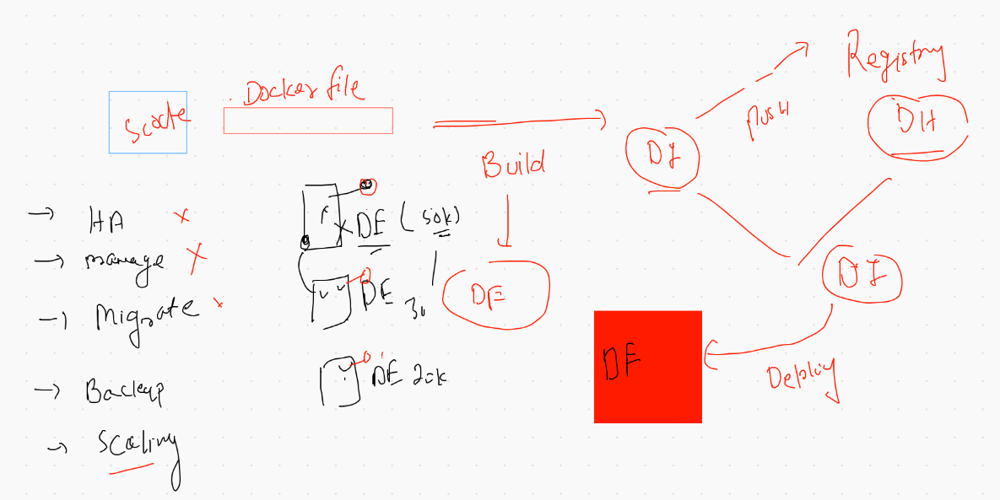
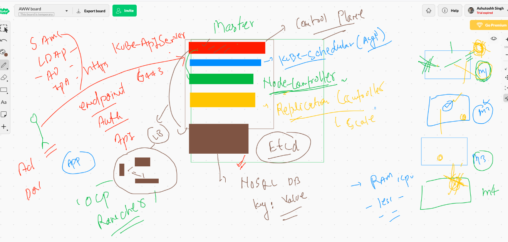
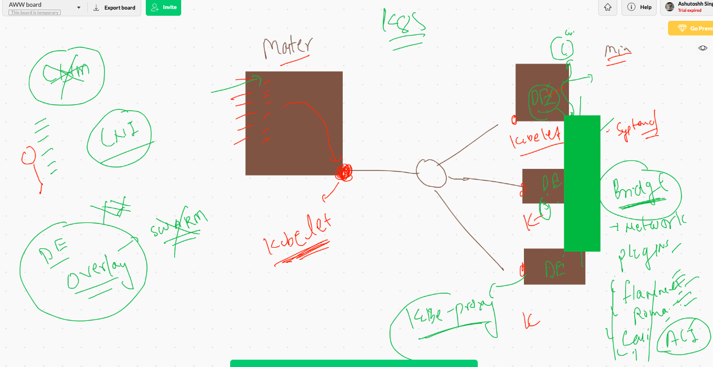
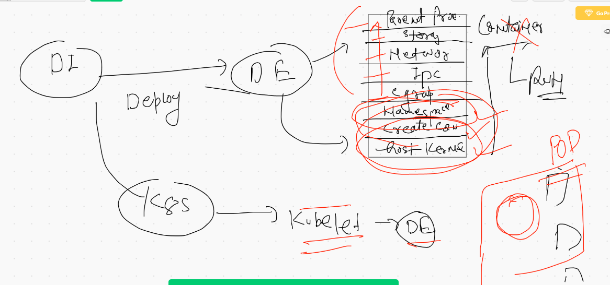
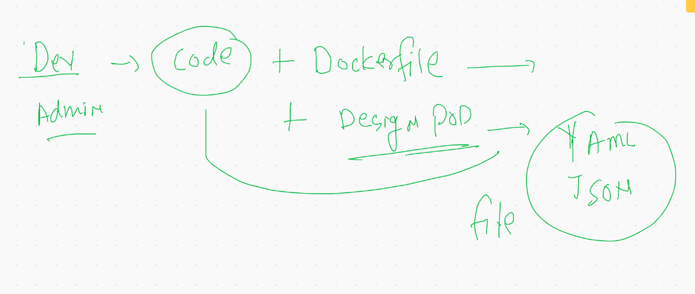

# Docker Build Process revesion 


## Docker client with Unix &. TCP socket 


## Starting docker Engine In tcp Socket 

```
[ec2-user@ip-172-31-58-55 ~]$ cd  /etc/sysconfig/
[ec2-user@ip-172-31-58-55 sysconfig]$ ls
acpid       clock     docker          init        modules          nfs            rpc-rquotad  run-parts  sysstat.ioconf
atd         console   docker-storage  irqbalance  netconsole       raid-check     rpcbind      selinux
authconfig  cpupower  grub            keyboard    network          rdisc          rsyncd       sshd
chronyd     crond     i18n            man-db      network-scripts  readonly-root  rsyslog      sysstat
[ec2-user@ip-172-31-58-55 sysconfig]$ sudo vim  docker 
[ec2-user@ip-172-31-58-55 sysconfig]$ cat  docker
# The max number of open files for the daemon itself, and all
# running containers.  The default value of 1048576 mirrors the value
# used by the systemd service unit.
DAEMON_MAXFILES=1048576

# Additional startup options for the Docker daemon, for example:
# OPTIONS="--ip-forward=true --iptables=true"
# By default we limit the number of open files per container
OPTIONS="--default-ulimit nofile=1024:4096   -H  tcp://0.0.0.0:2375"

# How many seconds the sysvinit script waits for the pidfile to appear
# when starting the daemon.
DAEMON_PIDFILE_TIMEOUT=10

```

## docker enginre reload 

```
[ec2-user@ip-172-31-58-55 sysconfig]$ sudo systemctl daemon-reload 
[ec2-user@ip-172-31-58-55 sysconfig]$ sudo systemctl restart  docker
[ec2-user@ip-172-31-58-55 sysconfig]$ sudo netstat -nlpt
Active Internet connections (only servers)
Proto Recv-Q Send-Q Local Address           Foreign Address         State       PID/Program name    
tcp        0      0 0.0.0.0:111             0.0.0.0:*               LISTEN      3345/rpcbind        
tcp        0      0 0.0.0.0:22              0.0.0.0:*               LISTEN      4644/sshd           
tcp        0      0 127.0.0.1:25            0.0.0.0:*               LISTEN      4172/master         
tcp        0      0 127.0.0.1:44605         0.0.0.0:*               LISTEN      4055/containerd     
tcp6       0      0 :::2375                 :::*                    LISTEN      5597/dockerd        
tcp6       0      0 :::111                  :::*                    LISTEN      3345/rpcbind        
tcp6       0      0 :::22                   :::*                    LISTEN      4644/sshd 
```

## connecting Docker engine using python client 

```
ashutoshhs-MacBook-Air:Desktop fire$ cat mydockercli.py 
import  docker
import time
# if you want to connect  Docker locally running on Mac / w /Linux 

client=docker.DockerClient(base_url='tcp://100.25.45.150:2375')

## code for listing image 

for  i in  client.containers.list():
	print i
	
## list of images 
for  i in  client.images.list():
	print i


```

# Docker Storage


## Configure storage

```
[ec2-user@ip-172-31-58-55 ~]$ sudo  mkdir  /mnt/cisco 
[ec2-user@ip-172-31-58-55 ~]$ 
[ec2-user@ip-172-31-58-55 ~]$ sudo  vim  /etc/sysconfig/docker 
[ec2-user@ip-172-31-58-55 ~]$ cat  /etc/sysconfig/docker
# The max number of open files for the daemon itself, and all
# running containers.  The default value of 1048576 mirrors the value
# used by the systemd service unit.
DAEMON_MAXFILES=1048576

# Additional startup options for the Docker daemon, for example:
# OPTIONS="--ip-forward=true --iptables=true"
# By default we limit the number of open files per container
OPTIONS="--default-ulimit nofile=1024:4096   -H  tcp://0.0.0.0:2375  -g  /mnt/cisco"

# How many seconds the sysvinit script waits for the pidfile to appear
# when starting the daemon.
DAEMON_PIDFILE_TIMEOUT=10


```

## checking new storage

```
  345  sudo systemctl daemon-reload 
  346  sudo systemctl restart  docker  
  347  sudo ls  /mnt/cisco/
  348  docker  info 
  349  history 
[ec2-user@ip-172-31-58-55 ~]$ sudo ls  /mnt/cisco/
builder  buildkit  containers  image  network  overlay2  plugins  runtimes  swarm  tmp	trust  volumes

```

## Container storage


## Docker volume 

```
  355  docker  volume  list
  356  docker  volume  create  ashuvol1 
  357  docker  volume  list
  358  docker run  -it  --rm  -v  ashuvol1:/mnt/data alpine  sh 
  359  docker  volume  ls
  360  docker  run  -it  -v  ashuvol1:/mydata   centos  bash 
  364  docker  voluem  ls
  365  docker  volume ls
  366  docker  volume inspect  ashuvol1 
  369  docker  volume inspect  ashuvol1 
  370  sudo ls  /mnt/cisco/volumes
  371  docker  volume create  x1 
  372  sudo ls  /mnt/cisco/volumes
  373  docker  volume inspect    x1 
  376  docker  volume  ls
  377  docker  run  -d  --name  x1ashu  -v  ashuvol1:/mnt/cool:rw   alpine  ping  fb.com  
  378  docker  run  -dit --name  x2x2  -v  ashuvol1:/mnt/data:ro   centos  bash 
  docker  run  -it --rm   -v  ashuvol1:/mnt/check:rw  -v  x1:/mnt/go:ro  alpine sh
  
  
  ```
  
  ## External forlder as volume 
  
  ```
  docker  run  -d -v  /home/ec2-user/day2/microsoftapp/project-html-website:/usr/share/nginx/html:ro  -p 1122:80   nginx  
  ```
  
  
# problems in Container based application deployment in prod Env



## K8s Master arch



## k8s minion 




# MInikube to Install Single Node K8s Cluster 

## Installing Minikube 

```
 416  curl -LO https://storage.googleapis.com/minikube/releases/latest/minikube-darwin-amd64
  417  ls -lh minikube-darwin-amd64 
  418  sudo install minikube-darwin-amd64 /usr/local/bin/minikube
  419  minikube version 
  
  ```
  
  # Kubernetes Deployment using kubeadm 
  
  ```
  [root@ip-172-31-68-168 ~]# cat  set.sh 
modprobe br_netfilter
echo '1' > /proc/sys/net/bridge/bridge-nf-call-iptables
swapoff  -a
cat  <<EOF  >/etc/yum.repos.d/kube.repo
[kube]
baseurl=https://packages.cloud.google.com/yum/repos/kubernetes-el7-x86_64
gpgcheck=0
EOF

yum  install  docker -y
yum  install kubeadm -y

systemctl  enable --now docker 
systemctl  enable --now kubelet

```

## Only On Master Node. : 

```
kubeadm  init --pod-network-cidr=192.168.0.0/16  --apiserver-advertise-address=0.0.0.0  --apiserver-cert-extra-sans=3.232.215.153


```

## output of above command will be 

```
Your Kubernetes control-plane has initialized successfully!

To start using your cluster, you need to run the following as a regular user:

  mkdir -p $HOME/.kube
  sudo cp -i /etc/kubernetes/admin.conf $HOME/.kube/config
  sudo chown $(id -u):$(id -g) $HOME/.kube/config

You should now deploy a pod network to the cluster.
Run "kubectl apply -f [podnetwork].yaml" with one of the options listed at:
  https://kubernetes.io/docs/concepts/cluster-administration/addons/

Then you can join any number of worker nodes by running the following on each as root:

kubeadm join 172.31.68.168:6443 --token n6k21g.vpjy1tcveorbw3sg \
    --discovery-token-ca-cert-hash sha256:246d7a85ce3f574a4830655fd7b2e4f48300e3520dd641d484f01efc311bb433 
    
```
    
    
## On the Master node deploy k8s calico Network pluging 

```
  kubectl apply -f https://docs.projectcalico.org/v3.8/manifests/calico.yaml
  
```


## K8s Client installation 

[link for k8s] ('https://kubernetes.io/docs/tasks/tools/install-kubectl/')

```
  410  curl -LO "https://storage.googleapis.com/kubernetes-release/release/$(curl -s https://storage.googleapis.com/kubernetes-release/release/stable.txt)/bin/darwin/amd64/kubectl"
  411  ls
  412  chmod +x ./kubectl
  413  sudo mv ./kubectl /usr/local/bin/kubectl
  414  kubectl version  --client
  
 ```
 
 ## DE -- containers -- But K8s -- PODS
 
 
 
 ## Dev pod
 
 
 
 # First POd Design 
 
 ```
 ashutoshhs-MacBook-Air:microservices fire$ cat  ashu-nginx.yaml 
apiVersion: v1  # For pod apiversion is v1 
kind: Pod
metadata:
 name: ashu-pod-1  #  name of pod that must be unique 
spec:
 containers:   # info about all the container as per app desing 
 - name: ashuc1
   image: nginx # this image will be pulled from Docker HUB 
   ports:
   - containerPort: 80 #  same expose keyword in Dockerfile
   
   
```

## Deploying pod 

```
  474  kubectl apply -f ashu-nginx.yaml  --dry-run=client
  475  kubectl apply -f ashu-nginx.yaml  
  476  kubectl  get  pods
  477  kubectl  get  pods
  478  kubectl  get  pods
  479  kubectl  get  pods
  480  kubectl  get  pods
  481  kubectl  get  pods
  482  kubectl get  nodes
  483  kubectl  get pods -o wide 
  484  kubectl  get pods  ashu-pod-1   -o wide 
  
  ```
  
  
