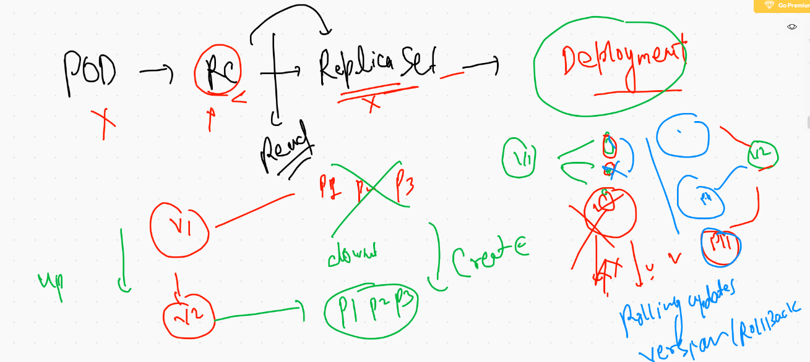
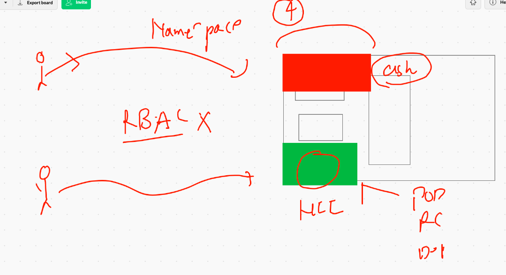

# K8s app deployment Model 


## Usage of CNI in K8s 


## checking CNI using pod Description 

```
❯ kubectl describe  pod  ashupod-1
Name:         ashupod-1
Namespace:    default
Priority:     0
Node:         ip-172-31-76-63.ec2.internal/172.31.76.63
Start Time:   Thu, 22 Oct 2020 10:52:06 +0530
Labels:       run=ashupod-1
Annotations:  cni.projectcalico.org/podIP: 192.168.208.2/32
Status:       Running
IP:           192.168.208.2
IPs:
  IP:  192.168.208.2

```

## checking pod connection  to other pods 

```
❯ kubectl  exec -it  ashupod-1  bash
kubectl exec [POD] [COMMAND] is DEPRECATED and will be removed in a future version. Use kubectl exec [POD] -- [COMMAND] instead.
[root@ashupod-1 html]# ping  192.168.208.3
PING 192.168.208.3 (192.168.208.3) 56(84) bytes of data.
64 bytes from 192.168.208.3: icmp_seq=1 ttl=254 time=0.076 ms
64 bytes from 192.168.208.3: icmp_seq=2 ttl=254 time=0.054 ms
64 bytes from 192.168.208.3: icmp_seq=3 ttl=254 time=0.052 ms
^C
--- 192.168.208.3 ping statistics ---
3 packets transmitted, 3 received, 0% packet loss, time 46ms
rtt min/avg/max/mdev = 0.052/0.060/0.076/0.014 ms

```

# K8s SErvices 


## NodePort Service 


## Nodeport with External Load balancer 


## check label of all the pODs

```
❯ kubectl get  pods   --show-labels
NAME            READY   STATUS    RESTARTS   AGE    LABELS
anirudh-pod-1   1/1     Running   0          134m   run=ashupod-1
ashupod-1       1/1     Running   0          136m   run=ashupod-1
grvpod-1        1/1     Running   0          134m   run=grvpod-1
nikpod-1        1/1     Running   0          135m   run=nikpod-1
nilapp          1/1     Running   0          24m    run=nilapp
nilaratan-1     1/1     Running   0          132m   run=nilaratan-1
sampleapp       1/1     Running   0          15m    run=sampleapp
soupod-1        1/1     Running   0          134m   run=soupod-1
sudarpod-1      1/1     Running   0          134m   run=sudarpod-1
❯ 
❯ 
❯ 
❯ kubectl get  pods ashupod-1   --show-labels
NAME        READY   STATUS    RESTARTS   AGE    LABELS
ashupod-1   1/1     Running   0          136m   run=ashupod-1

```

## Creating Node POrt. service 

```
❯ kubectl   create  service  nodeport  ashusvc1  --tcp  1234:80  --dry-run=client -o yaml
apiVersion: v1
kind: Service
metadata:
  creationTimestamp: null
  labels:
    app: ashusvc1
  name: ashusvc1
spec:
  ports:
  - name: 1234-80
    port: 1234
    protocol: TCP
    targetPort: 80
  selector:
    app: ashusvc1
  type: NodePort
status:
  loadBalancer: {}
❯ kubectl   create  service  nodeport  ashusvc1  --tcp  1234:80  --dry-run=client -o yaml  >ashuappsvc1.yml

```

## making changes in Label under selector section of service yaml 

```
❯ cat  ashuappsvc1.yml
apiVersion: v1
kind: Service
metadata:
  creationTimestamp: null
  labels:  #  label of service that is optional  for future use 
    hii: ashusvc1
  name: ashusvc1   #  name of servcie 
spec:
  ports:
  - name: 1234-80
    port: 1234  #  port of service  that will be bounded with service IP 
    protocol: TCP  
    targetPort: 80  #  app port 
  selector:  # this is the main thing in svc that will use label to find POD
    run: ashupod-1  #  same as POD label 
  type: NodePort
status:
  loadBalancer: {}
  
```

## checking services

```
❯ kubectl  get  services
NAME         TYPE        CLUSTER-IP       EXTERNAL-IP   PORT(S)           AGE
ashusvc1     NodePort    10.104.155.193   <none>        1234:31041/TCP    47s
grvsvc1      NodePort    10.111.162.1     <none>        1234:30526/TCP    9m45s
kubernetes   ClusterIP   10.96.0.1        <none>        443/TCP           163m
nilarsvc1    NodePort    10.111.37.219    <none>        12134:32475/TCP   38s
sampleapp    ClusterIP   10.97.102.66     <none>        1234/TCP          32m
sousvc1      NodePort    10.103.76.32     <none>        1234:32555/TCP    20s
❯ 
❯ 
❯ kubectl  get  svc
NAME          TYPE        CLUSTER-IP       EXTERNAL-IP   PORT(S)           AGE
anirudhsvc1   NodePort    10.108.15.187    <none>        1234:30074/TCP    6s
ashusvc1      NodePort    10.104.155.193   <none>        1234:31041/TCP    58s
grvsvc1       NodePort    10.111.162.1     <none>        1234:30526/TCP    9m56s
kubernetes    ClusterIP   10.96.0.1        <none>        443/TCP           164m
nilarsvc1     NodePort    10.111.37.219    <none>        12134:32475/TCP   49s
sampleapp     ClusterIP   10.97.102.66     <none>        1234/TCP          32m
sousvc1       NodePort    10.103.76.32     <none>        1234:32555/TCP    31s


```


## POD and SVC 

```
 kubectl  run  ashung1 --image=nginx --port  80
 
 kubectl expose pod ashung1  --type NodePort --port 1234 --target-port 80
 
 ```
 
 ## List POds,svc 
 
 ```
 kubectl get  pod,svc
NAME           READY   STATUS    RESTARTS   AGE
pod/ani1       1/1     Running   0          62s
pod/ashung1    1/1     Running   0          5m51s
pod/grvng1     1/1     Running   0          111s
pod/nikh1      1/1     Running   0          2m15s
pod/nilarng1   1/1     Running   0          116s
pod/sou1       1/1     Running   0          81s

NAME                 TYPE        CLUSTER-IP      EXTERNAL-IP   PORT(S)          AGE
service/ani1         NodePort    10.111.193.2    <none>        1234:30286/TCP   40s
service/ashung1      NodePort    10.99.15.112    <none>        1234:30859/TCP   3m24s
service/grvng1       NodePort    10.96.169.91    <none>        1234:32025/TCP   84s
service/kubernetes   ClusterIP   10.96.0.1       <none>        443/TCP          25m
service/nikh1        NodePort    10.101.225.37   <none>        1234:31162/TCP   108s
service/nilarng1     NodePort    10.103.86.224   <none>        1234:30092/TCP   98s
service/sou1         NodePort    10.107.42.78    <none>        1234:30892/TCP   2s

```

# Replication Controller 

```
cat  ashu-rc.yml
apiVersion: v1
kind: ReplicationController
metadata:
 name: ashurcapp1
spec:
 replicas: 1  #  no of default pod 
 template:
  metadata:
   name: ashupod1  # name field is optional 
   labels:
    x: ashuapp11
  spec:
   containers:
   - image: dockerashu/httpd:ashuv003
     name: ashuc1
     ports:
     - containerPort: 80
     
  ```
  
  ## Some command in RC 
  
  ```
   217  kubectl apply -f  ashu-rc.yml 
  218  kubectl  get  replicationcontroller
  219  kubectl  get  rc
  220  kubectl get  po 
  221  kubectl get  po -o wide
  222  kubectl  get  rc
  223  kubectl get  po 
  224  kubectl  expose rc  ashurcapp1  --type NodePort --port 1122 --target-port 80 
  225  kubectl get svc


```

###

```
 246  kubectl scale  rc   ashurcapp1  --replicas=5  
 
```
 
 # POD to Deployment journey 
 
 
 
 ```
 kubectl create  deployment  ashudep1  --image=dockerashu/httpd:ashuv003  --dry-run=client -o yaml  >ashudep1.yml
 
 ```
 
 ## Deployments in K8s
 
 ```
  256  kubectl create  deployment  ashudep1  --image=dockerashu/httpd:ashuv003  --dry-run=client -o yaml 
  257  kubectl create  deployment  ashudep1  --image=dockerashu/httpd:ashuv003  --dry-run=client -o yaml  >ashudep1.yml
  258  vim ashudep1.yml
  259  hist
  260  history
  261  kubectl apply -f ashudep1.yml
  262  kubectl get  deployment 
  263  kubectl get  deploy
  264  kubectl scale  deployment  ashudep1 --replicas=4
  265  kubectl get  deploy
  266  kubectl scale  deployment  ashudep1 --replicas=1
  
  ```
  
  ## Expose Deployment to create service
  
  ```
 kubectl expose deployment  ashudep1 --type NodePort --port 1212 --target-port 80
 
 ```
 
 ## Update application 
```
 kubectl  set  image deployment  ashudep1  httpd=dockerashu/httpd:ashuappv2
```
## checking Revision History 

```
❯ kubectl rollout history deployment  ashudep1
deployment.apps/ashudep1 
REVISION  CHANGE-CAUSE
1         <none>
2         <none>
```

# Namespaces in K8s 



```
❯ kubectl get  namespace
NAME              STATUS   AGE
default           Active   6h39m
kube-node-lease   Active   6h39m
kube-public       Active   6h39m
kube-system       Active   6h39m
❯ 
❯ 
❯ kubectl get  ns
NAME              STATUS   AGE
default           Active   6h40m
kube-node-lease   Active   6h40m
kube-public       Active   6h40m
kube-system       Active   6h40m

```

## check k8s component 

```
kubectl get  po  -n kube-system
NAME                                                   READY   STATUS    RESTARTS   AGE
calico-kube-controllers-bcc6f659f-2jx6h                1/1     Running   0          6h42m
calico-node-8sjrb                                      1/1     Running   0          6h42m
calico-node-dkzfz                                      1/1     Running   0          6h42m
calico-node-vjlvq                                      1/1     Running   0          6h42m
coredns-f9fd979d6-7t5lc                                1/1     Running   0          6h42m
coredns-f9fd979d6-fbd9n                                1/1     Running   0          6h42m
etcd-ip-172-31-72-45.ec2.internal                      1/1     Running   0          6h42m
kube-apiserver-ip-172-31-72-45.ec2.internal            1/1     Running   0          6h42m
kube-controller-manager-ip-172-31-72-45.ec2.internal   1/1     Running   0          6h42m
kube-proxy-nmkbh                                       1/1     Running   0          6h42m
kube-proxy-s44vs                                       1/1     Running   0          6h42m
kube-proxy-v779c                                       1/1     Running   0          6h42m
kube-scheduler-ip-172-31-72-45.ec2.internal 

```

## create NS 

```
❯ kubectl create  namespace  ashu-space
namespace/ashu-space created
❯ kubectl  get  ns
NAME              STATUS   AGE
ashu-space        Active   5s
default           Active   6h46m
kube-node-lease   Active   6h46m
kube-public       Active   6h46m
kube-system       Active   6h46m


```
